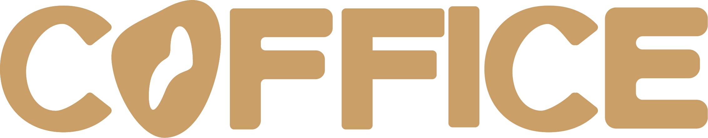
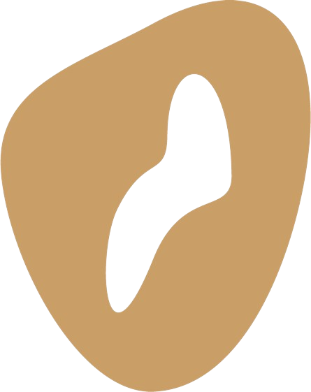

  
  
  

<h4>Bem vindo ao repositório do Coffice! Este Projeto está sendo realizado com intuito de fomentar a cultura e conhecimento acerca das cafeterias com ambiente de trabalho na cidade do Recife.<h4>

## 🗪 Visão Geral

O Coffice é uma plataforma que conecta profissionais a cafeterias ideais para trabalhar, estudar ou simplesmente desfrutar de um momento tranquilo. Facilitamos o processo de descobrir, filtrar e reservar espaços em cafeterias, enquanto você se integra a uma comunidade ativa que fornece feedback e valor à plataforma.

## 🔗 Links importantes 

  
  &nbsp;&nbsp;&nbsp;&nbsp;
  
  &nbsp;&nbsp;&nbsp;&nbsp;
  
  &nbsp;&nbsp;&nbsp;&nbsp;
  

## ⚙ Tecnologias Utilizadas

| Categoria                   | Tecnologia                                                                           |
|-----------------------------|--------------------------------------------------------------------------------------|
| *Linguagem de Programação*    |  |
| *Banco de Dados*               |  |
| *Framework de Desenvolvimento* |  |
| *Frontend*                     |    |
| *Organização*                  |  |

## 💼 Histórias de Usuário

| **Como usuário cliente:**   | **Como dono de cafeteria:**  |
|-----------------------------|------------------------------|
| 1. Gostaria de ver a listagem de cafeterias cadastradas   Como usuário cliente, gostaria de visualizar uma lista de todas as cafeterias cadastradas na plataforma Coffice, para que eu possa escolher o local ideal para trabalhar, estudar ou desfrutar de um momento tranquilo. | 1. Gostaria de cadastrar minha cafeteria   Como dono de cafeteria, gostaria de poder cadastrar minha cafeteria na plataforma Coffice, fornecendo informações detalhadas sobre o local, incluindo sua localização, horário de funcionamento, comodidades oferecidas e fotos, para que os usuários possam encontrar e conhecer meu estabelecimento. |
| 2. Gostaria de ver detalhes de uma cafeteria   Como usuário cliente, gostaria de visualizar os detalhes de uma cafeteria específica, incluindo sua localização, horário de funcionamento, comodidades oferecidas e avaliações de outros usuários, para que eu possa tomar uma decisão informada sobre onde ir. | 2. Gostaria de editar informações da minha cafeteria   Como dono de cafeteria, gostaria de poder editar as informações da minha cafeteria cadastrada na plataforma Coffice, para manter os detalhes do meu estabelecimento sempre atualizados e precisos. |
| 3. Gostaria de favoritar cafeterias   Como usuário cliente, gostaria de poder favoritar minhas cafeterias favoritas, para que eu possa acessá-las facilmente e receber notificações sobre promoções e eventos especiais. | |

## 🔄 Diagrama de Atividades

Aqui está o diagrama de atividades que ilustra o fluxo de interação entre os usuários e a plataforma Coffice.

## 🎥 ScreenCast

Nesta seção, você encontrará o screencast demonstrando o funcionamento da plataforma Coffice.

## 👥 Pair Programming

Nesta seção, você encontrará informações sobre as sessões de pair programming realizadas durante o desenvolvimento da plataforma Coffice.

## 👩‍💻 Membros

### CC 

<ul>
  <li>
    <a href="https://github.com/antnasc">Antonio Neto</a> - aaon@cesar.school 📩
  </li>
  <li>
    <a href="https://github.com/ArthurCapistrano">Arthur Silva</a> - asc@cesar.school 📩
  </li>
  <li>
    <a href="https://github.com/BernardoHeuer">Bernardo Heuer</a> - bchg@cesar.school 📩
  </li>
  <li>
    <a href="https://github.com/georgedfilho1">George Filho</a> - gdpf@cesar.school 📩
  </li>
  <li>
    <a href="https://github.com/gheysonmelo">Gheyson Melo</a> - gycm@cesar.school 📩
  </li>
  <li>
    <a href="https://github.com/joaocbf">João Cláudio</a> - jccbf@cesar.school 📩
  </li>
  <li>
    <a href="https://github.com/tempzz7">Thiago Queiroz</a> - tcq@cesar.school 📩
  </li>
  <li>
    <a href="https://github.com/Viniciuscahu">Vinicius Cahu</a> - vct@cesar.school 📩
  </li>
</ul>

### DESIGN

<ul>
  <li>
    Amanda Lima - amsl@cesar.school 📩
  </li>
  <li>
    Clara Vilanova - mcvl@cesar.school 📩
  </li>
  <li>
    João Gabriel Lima - jglx@cesar.school 📩
  </li>
  <li>
    Eduarda Xavier - mexs@cesar.school 📩
  </li>
</ul>

## 👩‍💻 Contribuintes Github

  

## 📝 Licença

Este projeto está licenciado sob a [Licença MIT](LICENSE).

