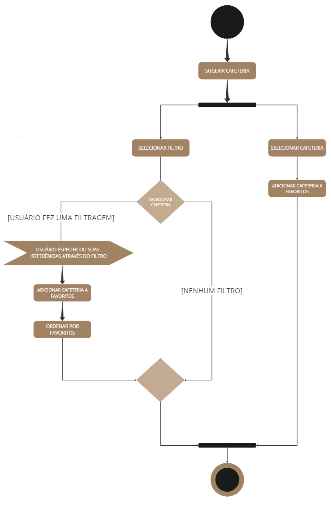
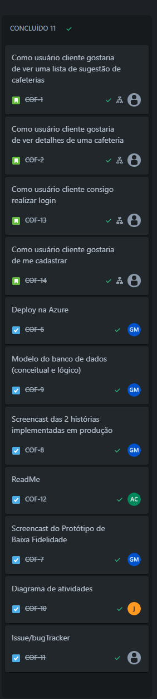
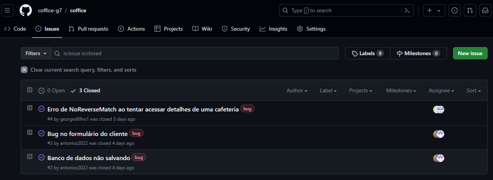
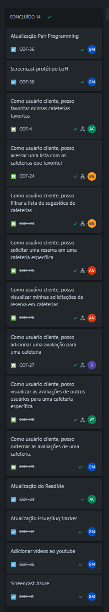
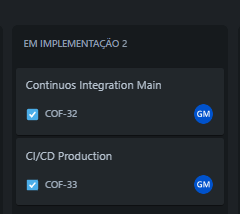
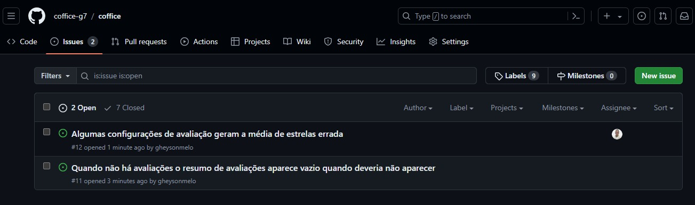
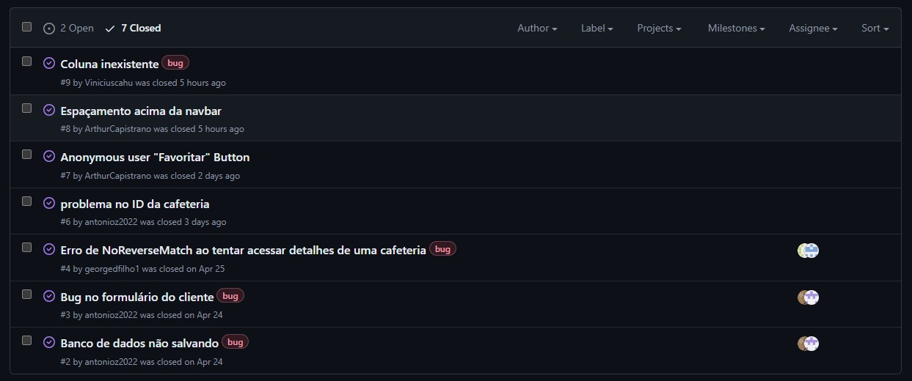

  
  
  

<h4>Bem vindo ao repositório do Coffice! Este Projeto está sendo realizado com intuito de fomentar a cultura e conhecimento acerca das cafeterias com ambiente de trabalho na cidade do Recife.<h4>

## 🗪 Visão Geral

O Coffice é uma plataforma que conecta profissionais a cafeterias ideais para trabalhar, estudar ou simplesmente desfrutar de um momento tranquilo. Facilitamos o processo de descobrir, filtrar e reservar espaços em cafeterias, enquanto você se integra a uma comunidade ativa que fornece feedback e valor à plataforma.

## 🔗 Links importantes

  <a href="https://sites.google.com/cesar.school/site-grupo7/home?authuser=1" style="text-decoration: none;">
    
    Google Sites
  </a>

  <a href="https://coffice.azurewebsites.net/" style="text-decoration: none;">
    
    Azure Site
  </a>

  <a href="https://coffice-pj2.atlassian.net/jira/software/projects/COF/boards/1" style="text-decoration: none;">
    
    Jira
  </a>

  <a href="https://miro.com/app/board/uXjVNjNdv6A=/" style="text-decoration: none;">
    
    Miro
  </a>

  <a href="https://www.youtube.com/channel/UCpPg-7nDrKEgPi6ADXkpfIA" style="text-decoration: none;">
    
    Youtube
  </a>

  <a href="https://www.figma.com/design/9wBimR8eslDPdtV7xWCUoB/Interface-Coffice?node-id=0-1&t=WS3vlL7hOQhJmC0H-0" style="text-decoration: none;">
    
    Figma
  </a>

## ⚙ Tecnologias Utilizadas

| Categoria                      | Tecnologia                                                                                                                                                                                                                                                                                                                                                                                                                                                                                                                                                                                                                  |
| ------------------------------ | --------------------------------------------------------------------------------------------------------------------------------------------------------------------------------------------------------------------------------------------------------------------------------------------------------------------------------------------------------------------------------------------------------------------------------------------------------------------------------------------------------------------------------------------------------------------------------------------------------------------------- |
| _Linguagem de Programação_     |                                                                                                                                                                                                                                                                                                                                                                                                                                                                         |
| _Banco de Dados_               |                                                                                                                                                                                                                                                                                                                                                                                                                                                             |
| _Framework de Desenvolvimento_ |                                                                                                                                                                                                                                                                                                                                                                                                                                                                         |
| _Frontend_                     |     |
| _Organização_                  |                                                                                                                                                                                                                                                                                                                                                                                                                                                                               |
| _Aplicação_                    |                                                                                                                                                                                                                               |

 <h1> 📝 Status Report 1 </h1> 

## 💼 Histórias de Usuário

### Como usuário cliente:

| Número | Descrição                                                                                                                                                                                                                                                                                                                                |
| ------ | ---------------------------------------------------------------------------------------------------------------------------------------------------------------------------------------------------------------------------------------------------------------------------------------------------------------------------------------- |
| 1.     | **Gostaria de ver uma lista de sugestão de cafeterias**   Como usuário cliente, gostaria de visualizar uma lista de sugestões de cafeterias na plataforma Coffice, com base na minha localização ou preferências, para que eu possa escolher o local ideal para trabalhar, estudar ou desfrutar de um momento tranquilo.              |
| 2.     | **Gostaria de ver detalhes de uma cafeteria**   Como usuário cliente, gostaria de visualizar os detalhes de uma cafeteria específica na plataforma Coffice, incluindo sua localização, horário de funcionamento, comodidades oferecidas e avaliações de outros usuários, para que eu possa tomar uma decisão informada sobre onde ir. |
| 3.     | **Consigo realizar login**   Como usuário cliente, gostaria de poder realizar o login na plataforma Coffice utilizando meu e-mail e senha cadastrados, para acessar minha conta e utilizar os recursos da plataforma.                                                                                                                 |
| 4.     | **Gostaria de me cadastrar**   Como usuário cliente, gostaria de poder me cadastrar na plataforma Coffice, fornecendo informações básicas como nome, e-mail e senha, para que eu possa acessar todos os recursos da plataforma.                                                                                                       |
| 5.     | **Gostaria de favoritar cafeterias**   Como usuário cliente, gostaria de poder favoritar minhas cafeterias favoritas na plataforma Coffice, para que eu possa acessá-las facilmente e receber notificações sobre promoções e eventos especiais.                                                                                       |
| 6.     | **Gostaria de filtrar a lista de sugestões de cafeterias**   Como usuário cliente, gostaria de poder filtrar a lista de sugestões de cafeterias na plataforma Coffice, por critérios como localização, comodidades oferecidas e avaliações, para encontrar o local ideal para mim.                                                    |
| 7.     | **Gostaria de ver uma lista com as cafeterias que favoritei**   Como usuário cliente, gostaria de poder acessar uma lista com as cafeterias que favoritei na plataforma Coffice, para que eu possa encontrá-las facilmente e verificar se há novidades ou promoções disponíveis.                                                      |

## 🔄 Diagrama de Atividades

  <a href="https://drive.google.com/drive/u/1/folders/1RlvqC1O59g56bpLv19bwYtHw1LVJ5vRn" style="text-decoration: none;">
    
    Diagrama
  </a>

## 🎥 ScreenCasts

Nesta seção, você encontrará os screencasts demonstrando o funcionamento da plataforma Coffice.

  <a href="https://www.youtube.com/watch?v=JsFyQICn7oA&ab_channel=G7projetos2" style="text-decoration: none;"> ScreenCast do Protótipo de Baixa Fidelidade
  </a>

  <a href="https://www.youtube.com/watch?v=-K9tpjrsI5k" style="text-decoration: none;"> ScreenCast do Sistema em Produção
  </a>

## 👥 Pair Programming

Arthur Silva - Bernardo Heuer

  <h4> História: Como usuário cliente gostaria de ver a listagem de cafeterias cadastradas</h4>
  
A programação em par foi dividida em dois momentos a fim de que ambos pudessem ocupar o papel de revisor e de desenvolvedor. O processo de desenvolvimento envolvendo criação da models, views, chamada de atributos do banco de dados e envio das informações foi realizado com Arthur desenvolvendo e Bernardo como o revisor. Ademais, durante a estilização inicial de todos os cards e esboço da futura funcionalidade de filtragem foi realizada por Bernardo com Arthur como revisor.

<h4> FeedBack: </h4> 
 Foi um ótima experiência uma vez que ao longo do desenvolvimento se faz útil para a revisão constante do código e insights para processo de desenvolvimento das histórias. 

Thiago Queiroz - Antônio Neto

  <h4> História: Como usuário cliente quero poder me cadastrar</h4>
  
A programação em par foi dividada em ambos ocupando o papel de revisores e desenvolvedores. O processo de desenvolvimento foi baseado na implementação da tela de registro e login, junto com todo processo de estilização e outras obrigações do Django, onde nós implementamos essa funcionalidade com sucesso e sem nenhum tipo de estresse, fruto da nossa colaboração e familiaridade em trabalhar juntos.

  <h4> FeedBack: </h4> 
 Foi uma experiência que nós, como equipe, sentimos que têm agregado bastante na nossa capacidade de desenvolvimento, apesar dos desafios iniciais com o Django, devido ao Projeto de "FDS" nós sentimos que estamos mais familiarizados com o framework, desenvolvendo bastante nossas habilidades e competências e aprendendo cada vez mais a trabalhar em conjunto. Foi uma ótima experiência

Vinícius Cahu - George Filho

  <h4> História: Gostaria de ver detalhes de uma cafeteria</h4>
  
 Na implementação da funcionalidade de visualização de detalhes de uma cafeteria, nós aplicamos a programação em par para dividir o trabalho de maneira eficiente. Enquanto Vinicius se concentrou na interação do usuário, George cuidou dos aspectos visuais.

  <h4> FeedBack: </h4> 
 Após a conclusão da implementação da funcionalidade de visualização de detalhes da cafeteria, podemos fornecer um feedback positivo sobre nossa experiência de trabalho em equipe e sobre o resultado alcançado.
Após a conclusão da implementação da funcionalidade de visualização de detalhes da cafeteria, podemos fornecer um feedback positivo sobre nossa experiência de trabalho em equipe e sobre o resultado alcançado.

A aplicação da programação em par foi fundamental para o sucesso do projeto. Trabalhando em conjunto, conseguimos dividir as tarefas de forma eficiente e aproveitar nossas habilidades individuais para alcançar um objetivo comum.

## 📊 Jira

## 🪲 Issue / Bug Tracker

 <h1> 📝 Status Report 2 </h1> 

## 💼 Histórias de Usuário

### Como usuário cliente:

| Número | Descrição                                                                                                                                                                                                       |
| ------ | --------------------------------------------------------------------------------------------------------------------------------------------------------------------------------------------------------------- |
| 1.     | **Posso filtrar cafeterias**   Como usuário cliente, posso filtrar a lista de sugestões de cafeterias, por critérios como "estou sozinho" ou "estou em grupo" para encontrar o local ideal para mim.         |
| 2.     | **Posso favoritar cafeterias**   Como usuário cliente, posso favoritar minhas cafeterias favoritas, para que eu possa visualizá-las facilmente.                                                              |
| 3.     | **Posso ver minha lista de favoritos**   Como usuário cliente, posso acessar uma lista com as cafeterias que favoritei, para que eu possa encontrá-las facilmente.                                           |
| 4.     | **Posso solicitar reserva em uma cafeteria**   Como usuário cliente, posso solicitar uma reserva em uma cafeteria específica, para garantir um lugar para trabalhar ou encontrar amigos.                     |
| 5.     | **Posso ver minhas solicitações de reserva**   Como usuário cliente, posso visualizar minhas solicitações de reserva em cafeterias, para acompanhar o status.                                                |
| 6.     | **Posso adicionar uma avaliação em uma cafeteria**   Como usuário cliente, posso adicionar uma avaliação para uma cafeteria, para compartilhar minha experiência com outros usuários.                        |
| 7.     | **Posso visualizar as avaliações de uma cafeteria**   Como usuário cliente, posso visualizar as avaliações de outros usuários para uma cafeteria específica, para tomar uma decisão informada sobre onde ir. |
| 8.     | **Posso visualizar de Resumo de Avaliações de Cafeterias**   Como usuário cliente, posso visualizar um resumo das avaliações de uma cafeteria, para conhecer as experiências de outros usuários.             |

## 🔄 Diagrama de Atividades

<a href="https://www.canva.com/design/DAGH5j6wZo4/6JcHpCJgeIYNR4-ZomDSQQ/view?utm_content=DAGH5j6wZo4&utm_campaign=designshare&utm_medium=link&utm_source=editor" style="text-decoration: none;">Diagrama de atividades</a>

## 🎥 ScreenCasts

Nesta seção, você encontrará os screencasts demonstrando o funcionamento da plataforma Coffice.

  🎥
  <a href="https://www.youtube.com/watch?v=Bk6yE1WRGJ4&ab_channel=G7projetos2" style="text-decoration: none;"> ScreenCast do Protótipo de Baixa Fidelidade
  </a>

  🎥
  <a href="https://www.youtube.com/watch?v=KYGdXnGrspE" style="text-decoration: none;"> ScreenCast do Sitema em Produção
  </a>

  🎥
  <a href="https://www.youtube.com/watch?v=fC3OhSjGkPA&ab_channel=G7projetos2" style="text-decoration: none;"> ScreenCast Execução dos testes
  </a>

## 👥 Pair Programming

Arthur Silva - Bernardo Heuer

  <h4> História: Como usuário cliente posso filtrar cafeterias</h4>
  

  
  <h4> História: Como usuário cliente posso favoritar cafeterias</h4>
  

  <h4> História: Como usuário cliente posso ver minha lista de favoritos</h4>
  

  <h4> FeedBack: </h4> 
  
No desenvolvimento dessas 3 histórias pudemos mesclar sobre o front e back end durante todo o processo, foi uma etapa mais de auxiliar um ao outro durante esse processo. Funcionou bem a programação em par, pois pudemos aprender um pouco a mais de cada "área". Bernardo esteve mais confortável no desenvolvimento front end enquanto Arthur no back end, as funções foram se alterando para nos pudessemos entender tudo que estávamos desenvolvendo, no fim, foi uma ótima prática e que, provavelmente, em momentos que um conheça mais de algo sobre o outro, voltar a realizar o pair programming. 

  

Thiago Queiroz - Antônio Neto

  <h4> História: Como usuário cliente posso solicitar reserva em uma cafeteria</h4>
  

  <h4> História: Como usuário cliente posso ver minhas solicitações de reserva</h4>
  

  <h4>FeedBack: </h4>
Trabalhar em par foi uma experiência extremamente enriquecedora para nós, Antonio e Thiago. Antonio focou no backend, implementando as rotas e a lógica para processar e exibir reservas, enquanto Thiago desenvolveu as interfaces intuitivas no frontend. Nossa comunicação constante permitiu alinhar expectativas e resolver problemas rapidamente. 

  

Vinícius Cahu - George Filho

  <h4> História: Como usuário cliente posso adicionar uma avaliação em uma cafeteria</h4>
  

  
  <h4> História: Como usuário cliente posso visualizar as avaliações de uma cafeteria</h4>
  

  
  <h4> História: Como usuário cliente posso ordenar as avaliações</h4>
  

  
  <h4> FeedBack: </h4>
 
Trabalhar em par foi uma experiência extremamente enriquecedora para nós. Ficamos com as historias das avaliações, Dividimos as telas para agilizar o processo, enquanto eu(Cahu) fazia o back da tela de ver avaliações,  George ja adiantava o front e o back da outra tela de avaliar cafeteria, e no final, fizemos a parte de ordenar avaliações. Foi uma experiencia muito bacana para nós, pelo trabalho em grupo. PS: Gheyson ajudou em algumas partes das nossas histórias.  

 

## 📊 Jira

## 🐛 Issue / Bug Tracker

## 👩‍💻 Membros

### CC

<ul>
  <li>
    <a href="https://github.com/antnasc">Antonio Neto</a> - aaon@cesar.school 📩
  </li>
  <li>
    <a href="https://github.com/ArthurCapistrano">Arthur Silva</a> - asc@cesar.school 📩
  </li>
  <li>
    <a href="https://github.com/BernardoHeuer">Bernardo Heuer</a> - bchg@cesar.school 📩
  </li>
  <li>
    <a href="https://github.com/georgedfilho1">George Filho</a> - gdpf@cesar.school 📩
  </li>
  <li>
    <a href="https://github.com/gheysonmelo">Gheyson Melo</a> - gycm@cesar.school 📩
  </li>
  <li>
    <a href="https://github.com/joaocbf">João Cláudio</a> - jccbf@cesar.school 📩
  </li>
  <li>
    <a href="https://github.com/tempzz7">Thiago Queiroz</a> - tcq@cesar.school 📩
  </li>
  <li>
    <a href="https://github.com/Viniciuscahu">Vinicius Cahu</a> - vct@cesar.school 📩
  </li>
</ul>

### DESIGN

<ul>
  <li>
    Amanda Lima - amsl@cesar.school 📩
  </li>
  <li>
    Clara Vilanova - mcvl@cesar.school 📩
  </li>
  <li>
    João Gabriel Lima - jglx@cesar.school 📩
  </li>
  <li>
    Eduarda Xavier - mexs@cesar.school 📩
  </li>
</ul>

## 👩‍💻 Contribuintes Github

  

## 📝 Licença

Este projeto está licenciado sob a [Licença MIT](LICENSE).
